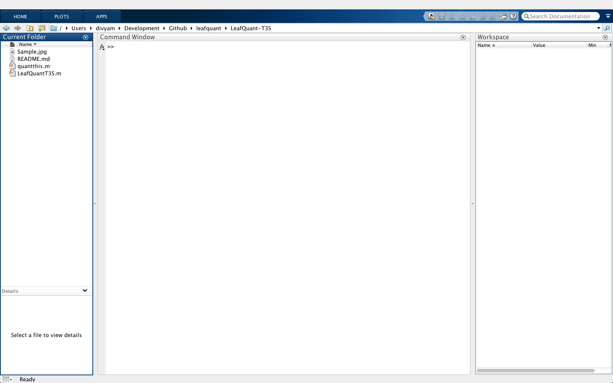
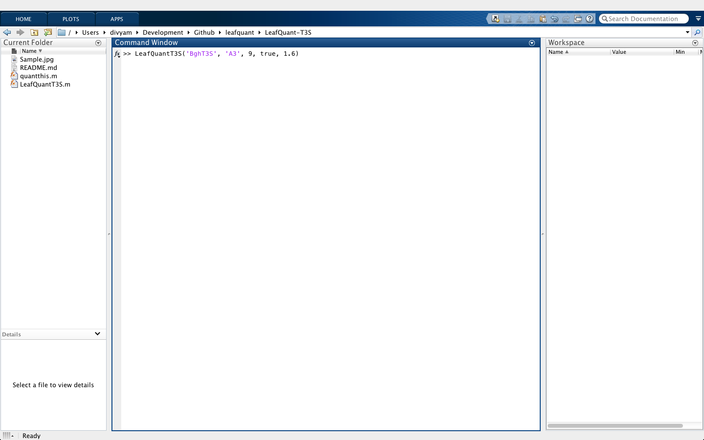
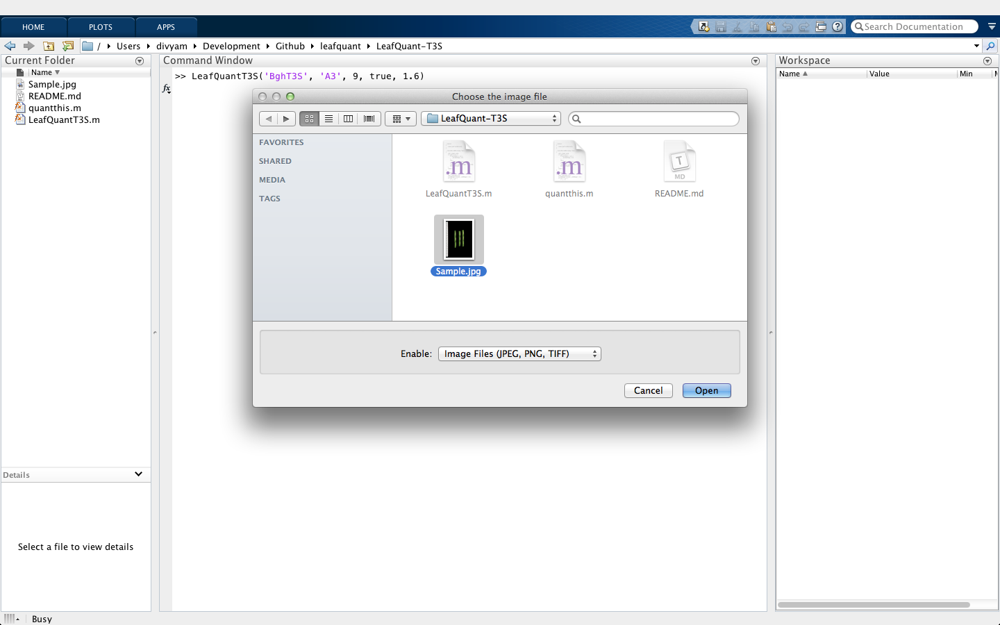
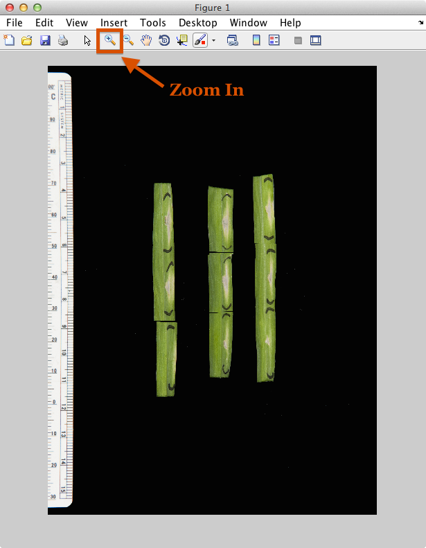
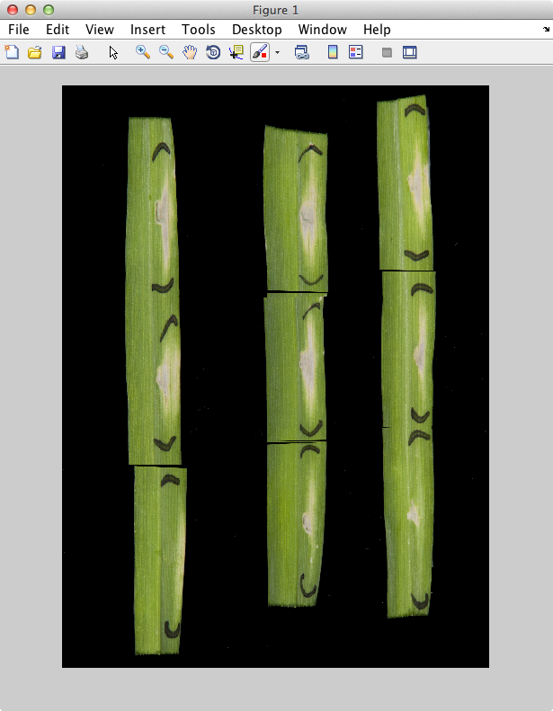
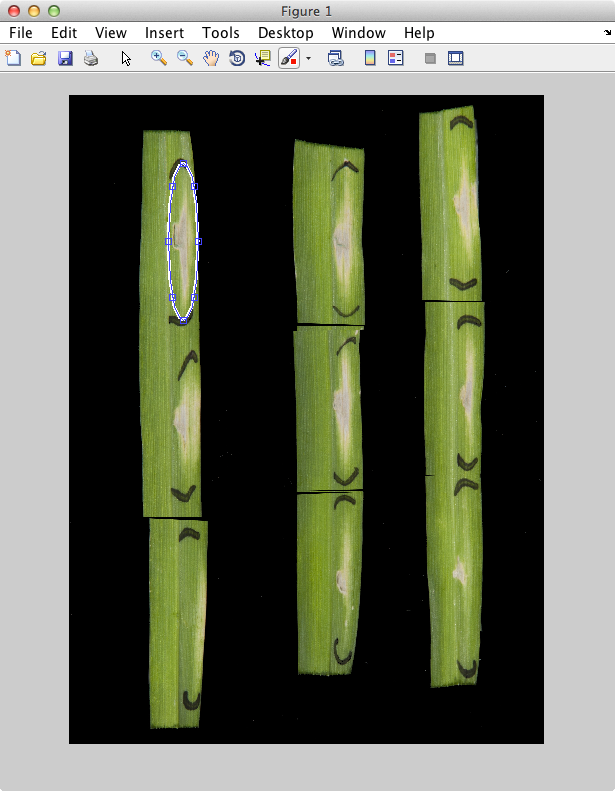
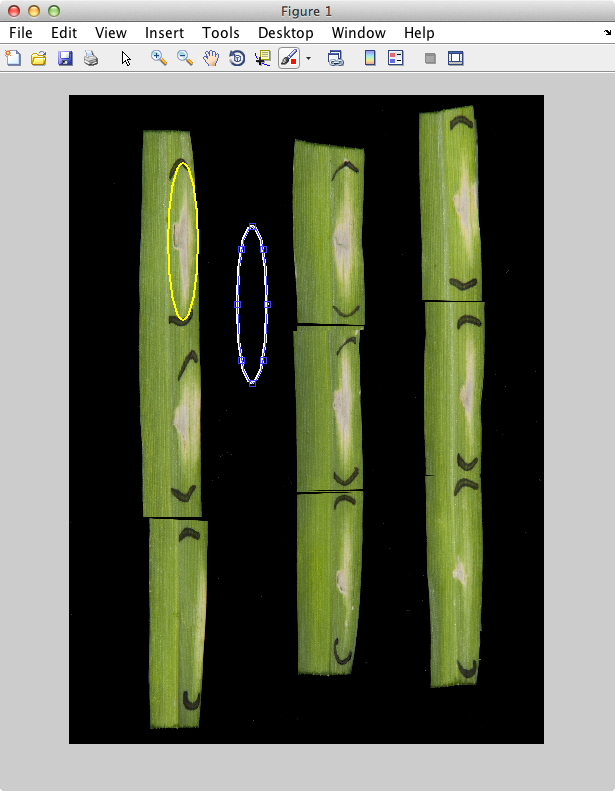
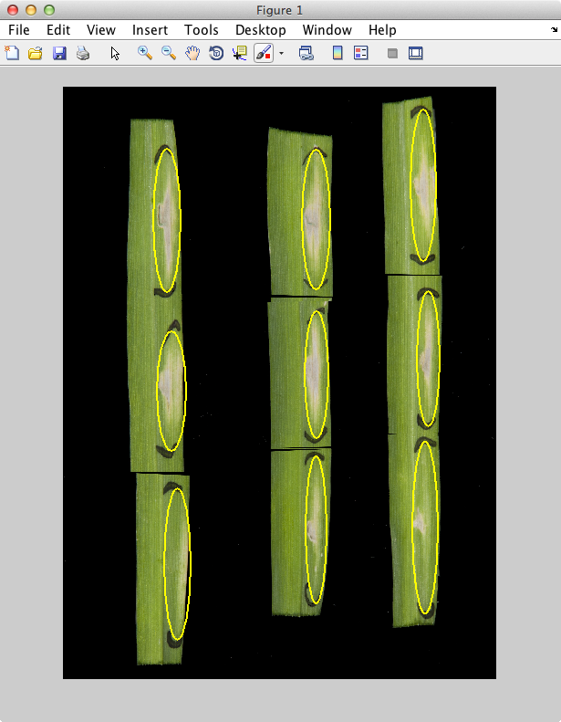
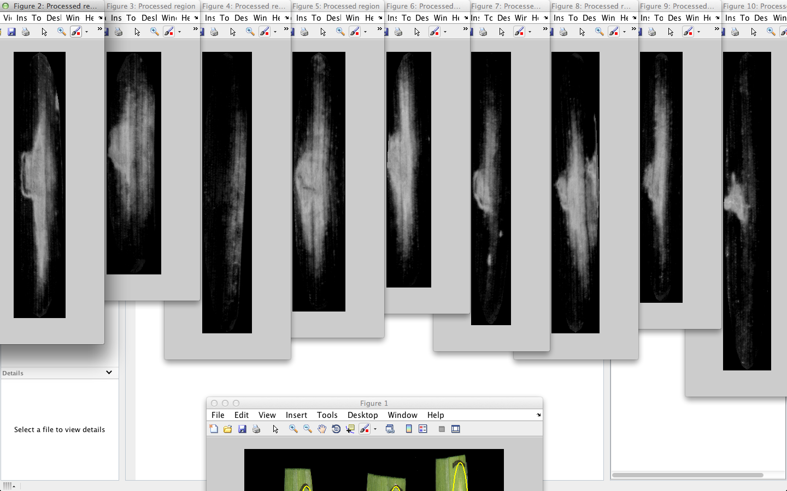
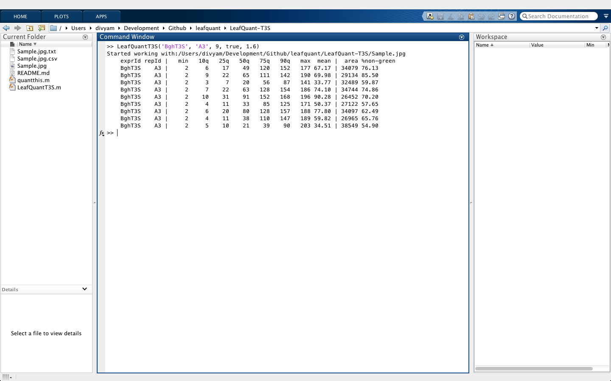

# LeafQuant-T3S

### Program requirements
LeafQuantT3S requires Mathworks MATLAB and the Image Processing Toolbox. Current version of the program has been tested on MATLAB v8.2 (R2013b) and Image Processing Toolbox v8.3 (R2013b).

### Some restrictions on the images that can be processed by LeafQuantT3S
I have yet to implement an automatic region detection in the code. Due to this, the program requires the user to select the region of infiltration. This user-intervention was **necessary** because there was no way to trace the _exact_ infiltration regions _after the fact_ when leaf photographs were taken. In future experiments, we may have images with exact marked regions which can be used to guide the automatic region detection. Until then we are utilizing this implementation. Even with this caveat, you'll see that LeafQuant performs remarkably well.

I employed MATLAB's built-in [ellipse roi selection](http://www.mathworks.com/help/images/ref/imellipse.html) method. The infiltration regions were approximately shaped like ellipse, and therefore it seemed like a better choice than letting user draw a freehand region. As a side-effect, you'll notice that in the attached `Sample.jpg` the leaves had to be "broken" into multiple sections. All I have done is selected part of a leaf and rotated it. No color, brightness, sharpness etc. adjustments were made. The unmodified original image is also included for your perusal. This is a **CRITICAL** point to make before you analyze your images as well. LeafQuant relies on the [RGB](http://en.wikipedia.org/wiki/RGB_color_model) color scale of the image, so the user has to be careful not to modify those. We are considering alternate color models for future, including processing [RAW](http://en.wikipedia.org/wiki/Raw_image_format) images directly.

### Required parameters for the image analysis of the barley leaves
  * `exprID` is a string representing the experiment. This can be any string that helps you identify set of leaves from one experiment to other.
  * `repID` is a string represting replicate of the experiment. This can be any string that helps you distinguish compared to other replicates.
  * `numOfRegions` is the integer telling how many infiltration sections will be quantified.
  * `showProcessedRegions` if set to `true` will show each of the selected regions in a separate processed grayscale image based on which quantification was done. If set to `false`, no such images are displayed.
  * `exposureVal` is a floating point number that manages quantity of non-green color to subtract from the pixels representing leaves. A value between `1.25` and `1.6` generally performs the best on our test images. This measure exists to allow corrections between photographs taken from different cameras and lighting conditions. You shouldn't have to change this if the camera, lighting conditions, image brightness, sharpness, etc. are left constant. There are examples of what this value does at the end of this user guide.

### Sample usage
There is a sample image called `Sample.jpg` included with this program. The image has 3 leaves, with three different spots of T3S infiltrations on each leaf. For the sake of this example, this image represents an experiment I call _BghT3S_, and it is my replicate _A3_. These names as no meaning for the except that they are useful for my record keeping. They'll be my `exprID` and `repID`. You can provide an empty string `''` for each if you prefer not to do use an ID.

##### Steps to get quantification results

  1. Start MATLAB, and navigate to the `LeafQuant-T3S` directory.<br/><br/><br/>
  2. On the MATLAB console, type the following command, and hit return.<br />
     ```matlab
     
     >> LeafQuantT3S('BghT3S', 'A3', 9, true, 1.6)
     
     ```
     <br/><br/>
  3. When the file picker pops up, choose the `Sample.jpg` image file, and click on `Open`. This should open the sample image in a viewer.<br/><br/><br/>
  4. The viewer is waiting for user to draw an ellipse. Go ahead and draw the ellipse as shown in the following screenshot.
    * You can optionally zoom into the image for a better selection if needed. <br/><br/>
    * After you're satisfied with the region you have selected, double click inside that region to indicate to LeafQuant that you are done selecting.<br/>
    * After you double click, the selected region will be marked in yellow. You should also see the result of LeafQuant's processing in the console.<br/>
    * For each of the infiltration spots, repeat this step. LeafQuant will let you select `numOfRegions` number of spots, which in this sample case was chosen `9`.<br/>
  5. Once all the spots are processed, following output will be available<br/> *Note: \<leafimage_file\> refers to the name of the file chosen in Step 3. In case of my example, that would be `Sample.jpg`*
    * A `<leafimage_file>.txt` file in the folder where original image was stored. This file has the MATLAB command along with parameters that were used to do the quantification. This is the command used in _Step 2_.
    * If `showProcessedRegions` was `true`, one window per infiltration spot selected will be opened for processed grayscale version.<br/>
    * A table of quantified regions in the console<br/>
    * The same table available as a `<leafimage_file>.csv` in the folder where original image was stored.

