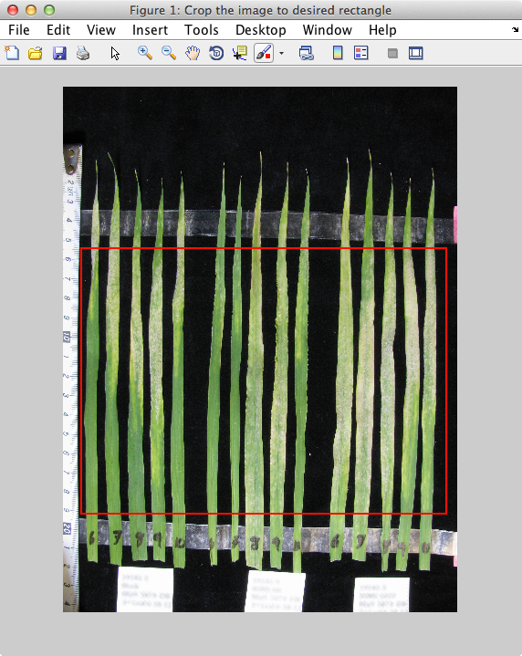

# LeafQuant-VIGS

### Program requirements
LeafQuantVIGS requires Mathworks MATLAB and the Image Processing Toolbox. Current version of the program has been tested on MATLAB v8.2 (R2013b) and Image Processing Toolbox v8.3 (R2013b).

### Required parameters for the image analysis of the barley leaves
  * `exprID` is a string representing the experiment. This can be any string that helps you identify set of leaves from one experiment to other.
  * `repID` is a string represting replicate of the experiment. This can be any string that helps you distinguish compared to other replicates.
  * `cropImageFirst` if `true`, the program allows you to select a region of the leaf photograph before processing it. If set to `false`, the program processes the whole photograph.
  * `showHistogram` if `true`, the program outputs a histogram of the discoloration intensities of grayscale image per leaf. If set to `false`, no histogram is displayed.
  * `numOfLeaves` is an integer representing number of leaves in the photograph (or the cropped image if `cropImageFirst` was `true`). <br/> (_Note: This is the number of total leaves in the image. If you have 10 leaves, but only want to quantify 5 of them, the program requires that you crop image to those five leaves, and provide `numOfLeaves` as `5`. This will be automated in the future, but the "belt and suspenders" are needed for now._)
  * `exposureVal` is a floating point number that manages quantity of non-green color to subtract from the pixels representing leaves. A value between `1.25` and `1.6` generally performs the best. This measure exists to allow corrections between photographs taken from different cameras and lighting conditions. You shouldn't have to change this if the camera, lighting conditions, image brightness, sharpness, etc. are left constant. There are examples of what this value does at the end of this user guide.

### Sample usage
There is a sample image, called `Sample.jpg`, included with this program. The image has 15 leaves, and we're interested in quantifying the mid-leaf regions for discoloration. Let's assume that this photograph was a result of an experiment we want to call _Bgh1_, and this is my replicate _B2_ for my own record keeping purposes.

Steps to get quantification results:

  1. Start MATLAB, and navigate to the `LeafQuant-VIGS` directory.<br/><br/><br/>
  2. On the MATLAB console, type the following command, and hit return. <br />
     ```matlab
     
     >> LeafQuantVIGS('Bgh1', 'B2', true, true, 15, 1.6)
     
     ```
     <br/><br/>
  3. When the file picker pops up, choose the `Sample.jpg` image file, and click on `Open`. This should open the sample image in a viewer.<br/><br/><br/>
  4. Select the region of leaves between the tapes. Once you have selected the area, double click anywhere within that selected region to indicate to LeafQuant that you're done selecting. After you double click, a new image window with just the cropped region should open up. Behind the viewer, you should also see the progress of the LeafQuant as it processes the leaves.
<br/><br/> <br/><br/>_(Note: This image viewer allows you to select the crop area only once per launch.)_
  5. Once all the leaves are processed, following output will be available. <br/> *Here, \<leafimage_file\> refers to the name of the file chosen in Step 3. In case of my example, that'd be `Sample.jpg`*
    * A `<leafimage_file>.txt` file in the folder where original image was stored. This file has the command along with parameters that were used to do the quantification. This is the command used in _Step 2_.
    * A window titled _Figure 3: Histogram of infection intensities per leaf_<br/><br/><br/>
    * A window titled _Figure 4: Processed grayscale image_<br/><br/><br/>
    * A window titled _Figure 5: Median intensities_<br/><br/><br/>
    * A window titled _Figure 6: % infected_<br/><br/><br/>
    * The table of quantified image in the console<br/><br/><br/>
    * The same table available as a `<leafimage_file>.csv` in the folder where original image was stored
    * The output of _Figure 4_ window as a `<leafimage_file>_processed.png` image file in the folder where original image was stored

